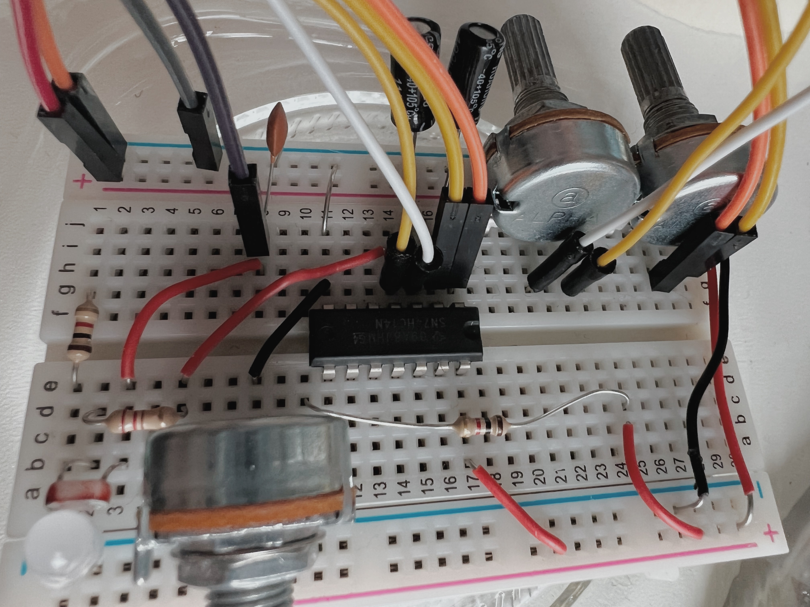

# Physical Computing Weblog 🦔  
Jasper Zheng (Shuoyang) / 21009460  
[Full Project Blog](https://github.com/msc-creative-computing/p-comp-jasper-zheng)

## Week_01: An Imagined Future Interface Using only Buttons and LEDs  
#### Sentient
A simulation of the evolving personality inside an AI.  
[Link to the full documentation / codes >>](https://github.com/msc-creative-computing/p-comp-jasper-zheng/tree/main/week_01)  

## Week_03: A Feedback System that Eventually Find its Equilibrium
#### Sentient (Reimagined)  
An evolving LED sequence with photoresistor that feedback on itself, constantly updating the moving speed and gradually reach an equilibrium. This is an extension to the week 1 creative lab: Sentient.  
[Link to the full documentation / codes >>](https://github.com/msc-creative-computing/p-comp-jasper-zheng/tree/main/week_03)  
  

## Week_08: Analog Synth!!  
#### Analog Synth with a Lowpass Filter and LFO
I made an analog synthesiser with three knobs:
 * The first one control the pitch of the oscillator.
 * The second one fine tune the pitch of the oscillator in a smaller range.
 * The third one controls the **LFO rate** of an **lowpass filter**.  

[Link to the full documentation / codes / schematic >>](https://github.com/msc-creative-computing/p-comp-jasper-zheng/tree/main/week_08)   
#### Video 1  
https://user-images.githubusercontent.com/74963879/144074482-88277755-2162-4c06-a4ae-e995757ad686.mp4

  
