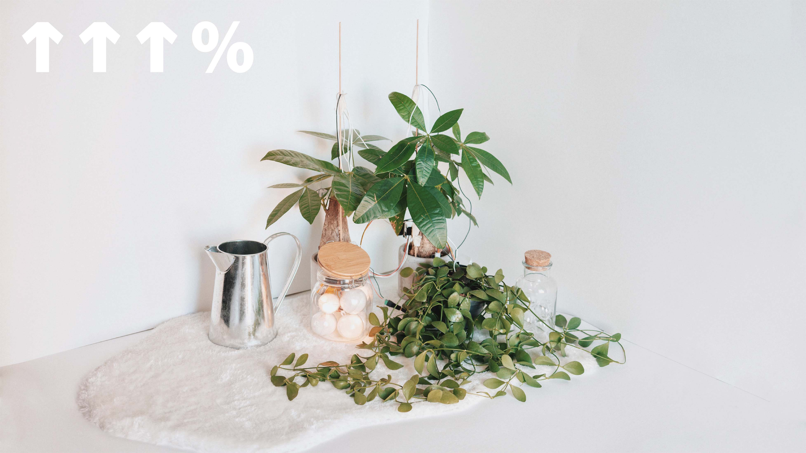

# ↑↑↑%  

    

↑↑↑% (up percent) is a sound installation that reveals possible interactions of plants, sound, light and humans. The assembled system is sensitive to changes in the electrostatic field, which can be triggered by either a soft touch from humans, wind, moisturisation, or the natural turbulent inside the vessels and vines. Measured changes control parameters of the digitally synthesised sound (oscillation frequencies, LFO rates, modulation index). Fluctuating light bulbs in the glass jar indicate the current level of activation of the system.  

<iframe width="560" height="315" src="https://www.youtube.com/embed/vGd-JQdAmYI" title="YouTube video player" frameborder="0" allow="accelerometer; autoplay; clipboard-write; encrypted-media; gyroscope; picture-in-picture" allowfullscreen></iframe>  
