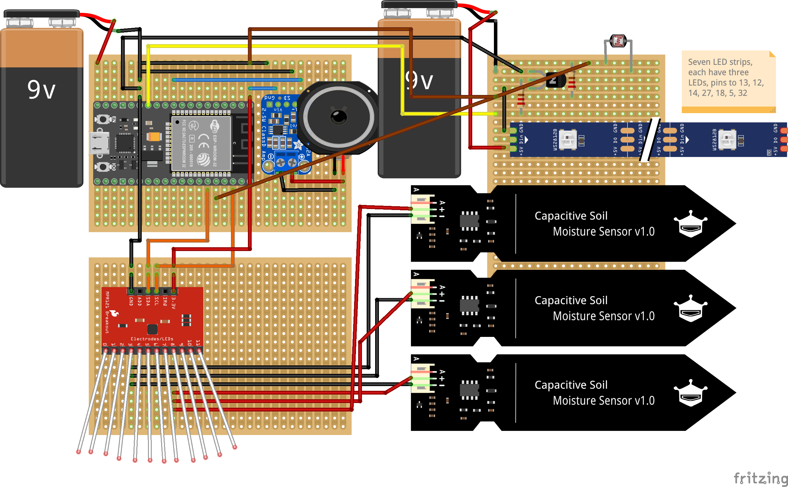

# ↑↑↑%  

    

↑↑↑% (up percent) is a sound installation that reveals possible interactions of plants, sound, light and humans. The assembled system is sensitive to changes in the electrostatic field, which can be triggered by either a soft touch from humans, wind, moisturisation, or the natural turbulent inside the vessels and vines. Measured changes **control parameters of the digitally synthesised sound (oscillation frequencies, LFO rates, modulation index)**. Fluctuating light bulbs in the glass jar indicate the current level of activation of the system.  

[Full Video 01](https://youtu.be/vGd-JQdAmYI) (Human interaction)  
[Full Video 02](https://youtu.be/jQ1evAxYSqI) (Wind interaction)

The installation attempts to aestheticise the chaotic dynamics in natural systems. While the vegetal lives produce unpredictable signals that manipulate the light and the tonal terrain, we are invited to review the possibility of 'organic collaborators' that we might confront in the future.  

## Technical Details  

#### Digitally Generated Sound  
The sound is real-time generated by the [Mozzi library](https://github.com/sensorium/Mozzi) running on a microcontroller ([ESP32](https://www.espressif.com/en/products/socs/esp32)). The output signal from the DAC is amplified by a mono D amplifier [PAM8302](https://www.adafruit.com/product/2130), and then passed to a speaker.  

(There is a 4-ohm speaker installed in the jar, however, when filming the video, I used an external loudspeaker just to get better sound recordings).  

#### Light Bulbs  
Seven hand-made light bulbs each consist of a strip with three LEDs, a control circuit on a custom PCB board, and some cotton.  

#### MPR121 and Soil Moisture Sensors
A capacitive touch sensor ([MPR121](https://learn.adafruit.com/adafruit-mpr121-12-key-capacitive-touch-sensor-breakout-tutorial/wiring)) picks up the 12-channel input data from different parts of the plants. Three soil moisture sensors are each attached to the soil.  

#### Photoresistor  
An LDR sticks to the edge of the jar manages to sense whether the lid is closed.

#### Power  
The system requires two 9v alkaline batteries (one for the light bulbs, one for the microcontroller).  

#### Schematic  
  

Circuit diagram created with Fritzing: [Fzz file](https://github.com/msc-creative-computing/p-comp-jasper-zheng/blob/main/week_final/assemble/schematic.fzz)  

#### Arduino Sketch  
Require [Mozzi Library](https://github.com/sensorium/Mozzi#installation)    
[Sketch file](https://github.com/msc-creative-computing/p-comp-jasper-zheng/blob/main/week_final/assemble/up_percent/up_percent.ino)
