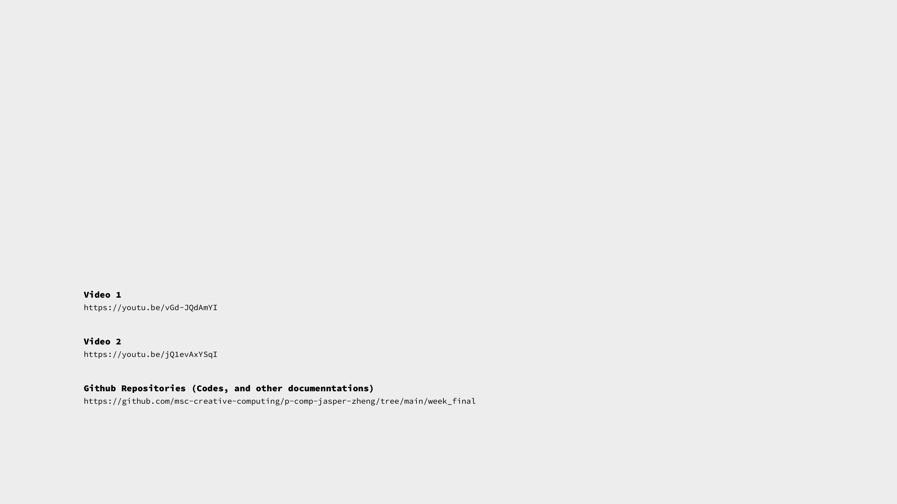

[PDF version](https://github.com/msc-creative-computing/p-comp-jasper-zheng/blob/main/week_final/Presentation_Board.pdf)  

    

[https://github.com/msc-creative-computing/p-comp-jasper-zheng/tree/main/week_final](https://github.com/msc-creative-computing/p-comp-jasper-zheng/tree/main/week_final)  

    

[https://youtu.be/vGd-JQdAmYI](https://youtu.be/vGd-JQdAmYI)   

    

[https://github.com/sensorium/Mozzi](https://github.com/sensorium/Mozzi)  

[https://learn.adafruit.com/adafruit-mpr121-12-key-capacitive-touch-sensor-breakout-tutorial](https://learn.adafruit.com/adafruit-mpr121-12-key-capacitive-touch-sensor-breakout-tutorial)    

    
    
    

Video 1   
[https://youtu.be/vGd-JQdAmYI](https://youtu.be/vGd-JQdAmYI)  

Video 2   
[https://youtu.be/jQ1evAxYSqI](https://youtu.be/jQ1evAxYSqI)  

Github Repositories (Codes, and other documenntations)  
[https://github.com/msc-creative-computing/p-comp-jasper-zheng/tree/main/week_final](https://github.com/msc-creative-computing/p-comp-jasper-zheng/tree/main/week_final)  
